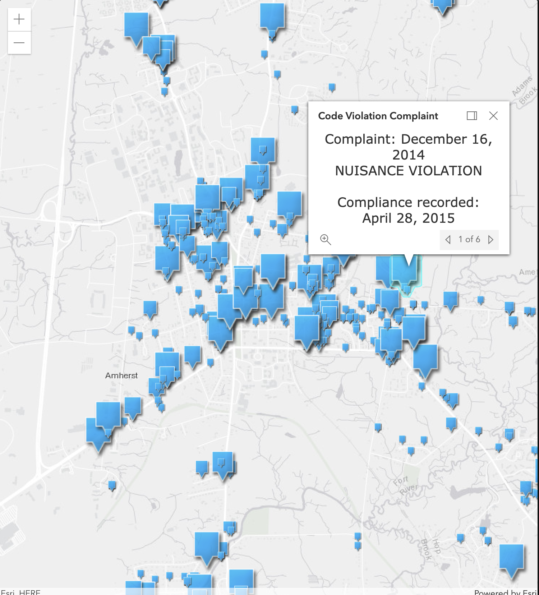
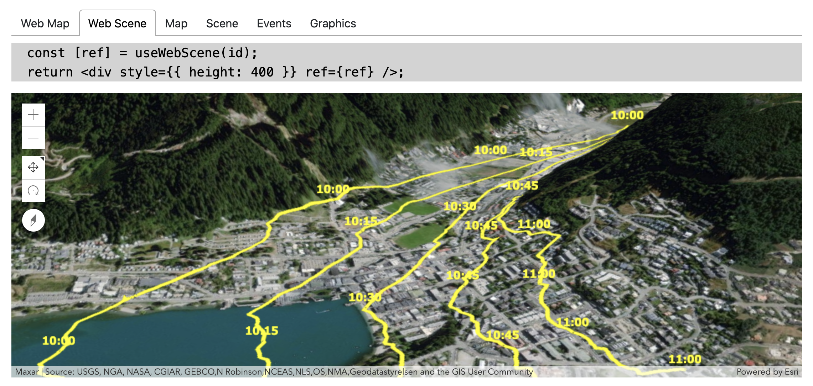
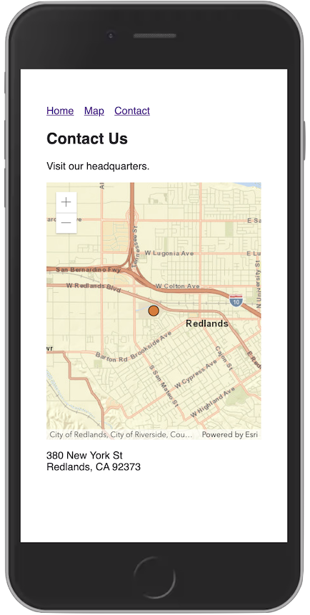

<!-- .slide: data-background="../img/2021/dev-summit/bg-1.png" data-background-size="cover -->
<h1 style="text-align: left; font-size: 80px;">ArcGIS API for JavaScript:</h1>
<h2 style="text-align: left; font-size: 60px;">Building Apps with React</h2>
<p>
<span style="text-align: center; font-size: 30px; margin: 1em;">Tom Wayson</span>
<span style="text-align: right; font-size: 30px; margin: 1em;">René Rubalcava</span>
</p>
<p>
<span style="text-align: center; font-size: 30px; margin: 1em;"><a href="https://github.com/tomwayson">@tomwayson</a></span>
<span style="text-align: right; font-size: 30px; margin: 1em;"><a href="https://github.com/odoenet">@odoenet</a></span>
</p>

---

<!-- .slide: data-auto-animate data-background="../img/2021/dev-summit/bg-4.png" -->
## Good News

This is easier than ever!

---

<!-- .slide: data-auto-animate data-background="../img/2021/dev-summit/bg-4.png" -->

> It just works

<p style="text-align: right;"><small>Tom, Dec 2020</small></p>

---

<!-- .slide: data-auto-animate data-background="../img/2021/dev-summit/bg-3.png" -->
## [@esri/react-arcgis](https://github.com/Esri/react-arcgis)

```jsx
<WebMap id="6627e1dd5f594160ac60f9dfc411673f" />
```

<a href="https://github.com/Esri/react-arcgis"></a>

---

<!-- .slide: data-auto-animate data-background="../img/2021/dev-summit/bg-2.png" -->
### Ready to use components

```js
import { Map, Scene, WebMap, WebScene } from '@esri/react-arcgis';
```

---

<!-- .slide: data-auto-animate data-background="../img/2021/dev-summit/bg-2.png" -->
### WebMaps and WebScenes

```jsx
<WebMap id={itemId} />
```

<small>or</small>

```jsx
<WebScene id={itemId} />
```

---

<!-- .slide: data-auto-animate data-background="../img/2021/dev-summit/bg-2.png" -->
### Maps and Views

```js
const mapProps = { basemap: "topo" };
const viewProps = {
    center: [-122.4443, 47.2529],
    zoom: 6
};
```

```jsx
<Map mapProperties={mapProps} viewProperties={viewProps} />
```

<small>or</small>

```jsx
<Scene mapProperties={mapProps} viewProperties={viewProps}  />
```

---

<!-- .slide: data-auto-animate data-background="../img/2021/dev-summit/bg-2.png" -->
### [Custom Components](https://github.com/Esri/react-arcgis#creating-your-own-components)

```jsx
<Scene class="full-screen-map">
  <BermudaTriangle />
</Scene>
```

[](https://github.com/Esri/react-arcgis#creating-your-own-components)

---

<!-- .slide: data-auto-animate data-background="../img/2021/dev-summit/bg-3.png" -->

## Creating Your Own Components

---

<!-- .slide: data-auto-animate data-background="../img/2021/dev-summit/bg-2.png" -->

### Creating a Map View

1. container (`<div id="map"></div>`)
1. map properties (`basemap: 'topo-vector'`)
1. view properties (`zoom: 8`)

---

<!-- .slide: data-auto-animate data-background="../img/2021/dev-summit/bg-2.png" -->

### Creating a Map View (no React)

```html
<div id="map"></div>
```

```js
const map = new ArcGISMap({
  basemap: 'topo-vector'
});
const view = new MapView({
  container: document.getElementById('map')
  map,
  center: [-118, 34],
  zoom: 8
});
```

---

<!-- .slide: data-auto-animate data-background="../img/2021/dev-summit/bg-2.png" -->

### Creating a Map View in React

1. Component renders container node
1. Create map view as a side effect

---

<!-- .slide: data-auto-animate data-background="../img/2021/dev-summit/bg-4.png" -->

### Component Concepts

- rendering
- refs
- side effects
- props/state

---

<!-- .slide: data-auto-animate data-background="../img/2021/dev-summit/bg-4.png" -->
### React [hooks](https://reactjs.org/docs/hooks-intro.html)

* `useRef()`
* `useEffect()`
* `useState()`

<p><small>See the <a href="https://github.com/odoe/2020-arcgis-presentations/tree/master/ds/ArcGIS-API-for-JavaScript-Using-Webpack-and-React">Using Webpack and React (2020) slides</a> for class based examples</small></p>

---

<!-- .slide: data-auto-animate data-background="../img/2021/dev-summit/bg-2.png" -->
### Rendering the container

```jsx
import React from 'react';

export const MapView = () => {
  return <div id="map" />;
};
```

<p class="fragment"><small><strong>Anti-pattern</strong>: do <strong>not</strong> render `id` in component</small></p>

---

<!-- .slide: data-auto-animate data-background="../img/2021/dev-summit/bg-2.png" -->
### [`useRef`](https://reactjs.org/docs/hooks-reference.html#useref) for the `container`

```jsx
import React, { useRef } from 'react';

export const MapView = () => {
  const mapRef = useRef();

  return <div ref={mapRef} />;
};
```

---

<!-- .slide: data-auto-animate data-background="../img/2021/dev-summit/bg-2.png" -->
### [`useEffect`](https://reactjs.org/docs/hooks-reference.html#useeffect) to create map & view

```jsx
  const mapRef = useRef();
  useEffect(
    () => {
      // create map and view
      const map = new ArcGISMap({
        basemap: 'topo-vector'
      });
      const view = new MapView({
        container: mapRef.current,
        map: map,
        center: [-118, 34],
        zoom: 8
      });
    }
  , []); // only after initial render
```

---

<!-- .slide: data-auto-animate data-background="../img/2021/dev-summit/bg-2.png" -->
### `<MapView />` Component

```jsx
import React, { useRef, useEffect } from 'react';
import createMapView from './utils/map';

export const MapView = () => {
  const mapRef = useRef();
  useEffect(() => {
    // create map and view
    const view = createMapView(mapRef.current);
    // clean up
    return () => { view && view.destroy(); };
  }, []); // only after initial render
  return <div ref={mapRef} />;
}
```

---

<!-- .slide: data-auto-animate data-background="../img/2021/dev-summit/bg-3.png" -->
### 🎉 Success! 🎉

<p>✅ created a component that renders a <code>container</code>
<p>✅ created a map view after the initial render</p>
<p>✅ only destroy <code>MapView</code> when unmounting</p>
<p class="fragment">🤔 component that takes map or view properties?</p>

---

<!-- .slide: data-auto-animate data-background="../img/2021/dev-summit/bg-2.png" -->
### Map & view properties

```jsx
<MapView basemap="streets" zoom="13" />
```

---

<!-- .slide: data-auto-animate data-background="../img/2021/dev-summit/bg-2.png" -->
### Use React `props`

```jsx
export const MapView = ({ basemap, zoom }) => {
  const mapRef = useRef();
  useEffect(() => {
    // read map and view properties from props
    const mapProperties = { basemap };
    const viewProperties = { zoom };
    // create map and view
    const view = createMapView(mapRef.current, mapProperties, viewProperties);
    // clean up
    return () => { view && view.destroy(); };
  }, []); // only after initial render
  return <div ref={mapRef} />;
}
```

---

<!-- .slide: data-auto-animate data-background="../img/2021/dev-summit/bg-2.png" -->
### Update map & view properties

```jsx
<MapView basemap={{basemap}} zoom="13" />
<BasemapSelect value={{basemap}} onChange={{setBasemap}} />
```

---

<!-- .slide: data-auto-animate data-background="../img/2021/dev-summit/bg-2.png" -->
### `useState`

```jsx
const [basemap, setBasemap] = useState('topo-vector');
```

---

<!-- .slide: data-auto-animate data-background="../img/2021/dev-summit/bg-2.png" -->
### `useState`

```jsx
export const MapPage => () {
  const [basemap, setBasemap] = useState('topo-vector');
  return (
    <MapView basemap={{basemap}} zoom="13" />
    <BasemapSelect value={{basemap}} onChange={{setBasemap}} />
  );
}
```

---

<!-- .slide: data-auto-animate data-background="../img/2021/dev-summit/bg-2.png" -->
### Update view or map properties

Use another effect in `<MapView>`

```jsx
  useEffect(() => {
    // TODO: view is undefined
    view.map.basemap = basemap;
  }, [basemap]); // called whenever basemap prop changes
```

---

<!-- .slide: data-auto-animate data-background="../img/2021/dev-summit/bg-2.png" -->
### Hold onto view in state

```jsx
// in MapView component
const [view, setView] = useState(null);
// later in useEffect()
setView(createMapView(mapRef.current, mapProperties, viewProperties));
```

---

<!-- .slide: data-auto-animate data-background="../img/2021/dev-summit/bg-2.png" -->
### Only update if view has been created

```jsx
  useEffect(() => {
    if (!view) {
      // this was called before setView()
      return;
    }
    view.map.basemap = basemap;
  }, [view, basemap]);
```

---

<!-- .slide: data-auto-animate data-background="../img/2021/dev-summit/bg-3.png" -->
### 🎉 Success! 🎉

<p>✅ initialize map & view properties from <code>props</code></p>
<p>✅ update map or view when <code>props</code> change</p>
<p class="fragment">🤔 Relay map view changes to other components?</p>

---

<!-- .slide: data-auto-animate data-background="../img/2021/dev-summit/bg-2.png" -->
### Pass watch or event callbacks as props

```jsx
<MapView basemap={{basemap}} zoom="13" onClick={{logClick}} />
```

---

<!-- .slide: data-auto-animate data-background="../img/2021/dev-summit/bg-2.png" -->
### Wire up handlers

Use another effect in `<MapView>`

```jsx
  useEffect(() => {
    if (!view) {
      return;
    }
    const handle = view.on('click', onClick);
    return function removeHandle() {
      handle && handle.remove();
    };
  }, [view, onClick]);
```

<p><small>use clean-up functions to remove event & watch handlers</small></p>

---

<!-- .slide: data-auto-animate data-background="../img/2021/dev-summit/bg-2.png" -->
### Components

A bridge between your React app and the ArcGIS API

---

<!-- .slide: data-auto-animate data-background="../img/2021/dev-summit/bg-4.png" -->
## Modern React and the ArcGIS API

---

<!-- .slide: data-auto-animate data-background="../img/2021/dev-summit/bg-2.png" -->
### Manage global state in React

* You may not need Redux/MobX
* Context is powerful, and injectable

---

<!-- .slide: data-auto-animate data-background="../img/2021/dev-summit/bg-2.png" -->
### `useContext` hook

```jsx
import ThemeContext from '.ThemeContext';

const ThemedMap = () => {
  const theme = useContext(ThemeContext);
  const basemap = theme === 'dark'
    ? 'dark-gray'
    : 'gray';
  return (
    <Map basemap={basemap} />
  );
};
```

---

<!-- .slide: data-auto-animate data-background="../img/2021/dev-summit/bg-4.png" -->
## Modularize API usage

---

<!-- .slide: data-auto-animate data-background="../img/2021/dev-summit/bg-2.png" -->
* Do all the API work separate from your UI
* _Separate content from navigation_ - pattern in PWAs
* Mock/stub API in tests

```ts
// src/data/map.ts
export function initialize(element: Element) {
  view.container = element;
  view.when(() => {
    // magic
  });
}
```

---

<!-- .slide: data-auto-animate data-background="../img/2021/dev-summit/bg-2.png" -->
* Use in your context or component

```ts
const elRef = useRef(null);
useEffect(
  () => {
    const loadMap = async () => {
      const map = await import("../data/map");
      map.initialize(elRef.current);
    };
    loadMap();
  },
  []
);
```

---

<!-- .slide: data-auto-animate data-background="../img/2021/dev-summit/bg-2.png" -->
## Why lazy load the API?

* So webpack can create async bundles
* `bundle1.js` -> `bundle2.js` -> `bundle3.js`
* Only load the resources you need when you need them
* Leads to faster initial loads

---

<!-- .slide: data-auto-animate data-background="../img/2021/dev-summit/bg-4.png" -->
## Suspense

---

<!-- .slide: data-auto-animate data-background="../img/2021/dev-summit/bg-2.png" -->
## Hold your Suspense

* Lazy-load entire React components
* useful in modular apps

```tsx
import React, { lazy, Suspense } from "react";
// lazy load the components that use Maps
const WebMapView = lazy(() => import("../components/WebMapView"));
// later on
<Suspense  fallback={<div>Loading...</div>}>
  <WebMapView />
</Suspense>
```

---

<!-- .slide: data-auto-animate data-background="../img/2021/dev-summit/bg-2.png" -->
## Hold your Suspense

* Still not out of beta, so use at your own risk


---

<!-- .slide: data-auto-animate data-background="../img/2021/dev-summit/bg-3.png" -->
##  Demo: [React with ESM](https://github.com/odoe/jsapi-esm-react)

---

<!-- .slide: data-auto-animate data-background="../img/2021/dev-summit/bg-4.png" -->
## [@arcgis/core](https://npmjs.com/package/@arcgis/core)

<div>
  
  
  
  
</div>

---

<!-- .slide: data-auto-animate data-background="../img/2021/dev-summit/bg-3.png" data-transition="fade" -->
### ArcGIS API is different

- powerful library with large footprint
- uses dynamic module loading & web workers
- can slow your build; or not work w/ defaults <!-- .element class="fragment" -->

---

<!-- .slide: data-auto-animate data-background="../img/2021/dev-summit/bg-3.png" data-transition="fade" -->
### Is your bundler smarter than you?

<div>
  
  <span style="font-size: 110px; position: relative; top: -30px">🤔</span>
  
  
</div>

---

<!-- .slide: data-auto-animate data-background="../img/2021/dev-summit/bg-3.png" data-transition="fade" -->

### Try [esri-loader](https://github.com/Esri/esri-loader)

<div>
  
  
  
  
  
  
</div>

---

<!-- .slide: data-auto-animate data-background="../img/2021/dev-summit/bg-2.png" data-transition="fade" -->
### Installing [esri-loader](https://github.com/Esri/esri-loader#install)


<h3><code>npm install --save esri-loader</code></h3>

---

<!-- .slide: data-auto-animate data-background="../img/2021/dev-summit/bg-2.png" data-transition="fade" -->
### Installing [esri-loader](https://github.com/Esri/esri-loader#install)


<h3><code>yarn add esri-loader</code></h3>

---

<!-- .slide: data-auto-animate data-background="../img/2021/dev-summit/bg-2.png" data-transition="fade-in none" -->
### Using [`loadModules()`](https://github.com/Esri/esri-loader#usage)

```js
import { loadModules } from 'esri-loader';

loadModules([
  "esri/Map",
  "esri/views/MapView"
]).then(([Map, MapView]) => {
  // Code to create the map and view will go here
});
```

---

<!-- .slide: data-auto-animate data-background="../img/2021/dev-summit/bg-2.png" data-transition="none fade-out" -->
### How it works

```js
// calls require() once the ArcGIS script is loaded

require([
  "esri/Map",
  "esri/views/MapView"
], (Map, MapView) => {
  // Code to create the map and view will go here
});
```

---

<!-- .slide: data-auto-animate data-background="../img/2021/dev-summit/bg-2.png" data-transition="fade" -->
### [Lazy loads the ArcGIS API](https://github.com/Esri/esri-loader#lazy-loading-the-arcgis-api-for-javascript)

<pre class="language-js">
<code class="language-js">
 // injects a script tag the first time
const esriConfig = await loadModules(["esri/config"])
esriConfig.useIdentity = false;

// don't worry, this won't load the API again!
const [Map, MapView] = await loadModules(
  ["esri/Map", "esri/views/MapView"]
);</code></pre>

Defaults to latest CDN version <!-- .element class="fragment" -->

---

<!-- .slide: data-auto-animate data-background="../img/2021/dev-summit/bg-3.png" 
data-transition="none fade-out" -->

### [esri-loader options](https://github.com/Esri/esri-loader/#configuring-esri-loader)

- Use an earlier release, even 3.x!
- Use a local AMD build
- Lazy load CSS

---

<!-- .slide: data-auto-animate data-background="../img/2021/dev-summit/bg-3.png" 
data-transition="none fade-out" -->

### Keeps ArcGIS API out of your build

<ul class="fragment">
  <li>faster builds</li>
  <li>greater tool compatibility</li>
</ul>

---

<!-- .slide: data-auto-animate data-background="../img/2021/dev-summit/bg-4.png" -->
### [@esri/react-arcgis](https://github.com/Esri/react-arcgis#installation) uses esri-loader

```bash
npm i --save esri-loader @esri/react-arcgis
```

---

<!-- .slide: data-auto-animate data-background="../img/2021/dev-summit/bg-4.png" -->
### [esri-loader-hooks](https://www.npmjs.com/package/esri-loader-hooks)

```bash
npm i --save esri-loader esri-loader-hooks
```

---

<!-- .slide: data-auto-animate data-background="../img/2021/dev-summit/bg-2.png" -->
### [esri-loader-hooks](https://www.npmjs.com/package/esri-loader-hooks)

```js
import { 
  useMap, useScene, useWebMap, useWebScene, // create a map or scene
  useEvent, useEvents, useWatch, useWatches, // handle events or property changes
  useGraphic, useGraphics // add graphics to a map/scene
} from 'esri-loader-hooks';
```

---

<!-- .slide: data-auto-animate data-background="../img/2021/dev-summit/bg-2.png" -->
### [esri-loader-hooks](https://github.com/tomwayson/esri-loader-hooks#usewebmap)

```jsx
function WebMap() {
  const [ref] = useWebMap('6627e1dd5f594160ac60f9dfc411673f');
  return <div style={{ height: 400 }} ref={ref} />;
}
```

<a href="https://esri-loader-hooks.netlify.com/"></a>

---

<!-- .slide: data-auto-animate data-background="../img/2021/dev-summit/bg-3.png" -->
### Example: [esri-loader-hooks](https://esri-loader-hooks.netlify.com/)

<a href="https://esri-loader-hooks.netlify.com/"></a>

---

<!-- .slide: data-auto-animate data-background="../img/2021/dev-summit/bg-3.png" 
data-transition="none fade-out" -->

### When to use esri-loader?

- Rapid prototyping, hackathons
- Your (hipster) tools have trouble with `@arcgis/core`

---

<!-- .slide: data-auto-animate data-background="../img/2021/dev-summit/bg-4.png" -->
### Example: [esri-gatsby](https://github.com/tomwayson/esri-gatsby)

<div>
  
  
</div>

ArcGIS API + [Gatsby](https://www.gatsbyjs.com)

---

<!-- .slide: data-auto-animate data-background="../img/2021/dev-summit/bg-3.png" -->
### Example: [esri-gatsby](https://tomwayson.github.io/esri-gatsby/)

<a href="https://tomwayson.github.io/esri-gatsby/"></a>

---

<!-- .slide: data-auto-animate data-background="../img/2021/dev-summit/bg-2.png" -->
### [Map Component](https://github.com/tomwayson/esri-gatsby/blob/fe793c9b1aadfebece9b397471e1e3e947317f02/src/components/Map.js)

```jsx
<Map latitude={34.0573} longitude={-117.1949} />
```

---

<!-- .slide: data-auto-animate data-background="../img/2021/dev-summit/bg-4.png" -->
## Conclusion

<div>
  
  
  
</div>

---

<!-- .slide: data-auto-animate data-background="../img/2021/dev-summit/bg-5.png" -->


---

<!-- .slide: data-auto-animate data-background="../img/2021/dev-summit/2021-feedback.jpg" -->
