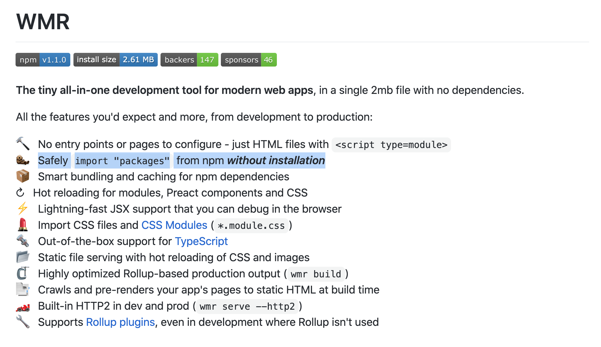

<!-- .slide: data-background="../img/2021/dev-summit/bg-1.png" data-background-size="cover -->
<h1 style="text-align: left; font-size: 80px;">ArcGIS API for JavaScript:</h1>
<h2 style="text-align: left; font-size: 60px;">Options for Consuming the API</h2>
<p>
<span style="text-align: left; font-size: 30px; margin: 1em;">Andy Gup</span>
<span style="text-align: center; font-size: 30px; margin: 1em;">Tom Wayson</span>
<span style="text-align: right; font-size: 30px; margin: 1em;">René Rubalcava</span>
</p>
<p>
<span style="text-align: left; font-size: 30px; margin: 1em;"><a href="https://github.com/agup">@agup</a></span>
<span style="text-align: center; font-size: 30px; margin: 1em;"><a href="https://github.com/tomwayson">@tomwayson</a></span>
<span style="text-align: right; font-size: 30px; margin: 1em;"><a href="https://github.com/odoenet">@odoenet</a></span>
</p>

---

<!-- .slide: data-auto-animate data-background="../img/2021/dev-summit/bg-3.png" data-transition="fade" -->
## Agenda

- Modules, modules, modules - what does it all mean?
- ES Modules
- esri-loader

---

<!-- .slide: data-auto-animate data-background="../img/2021/dev-summit/bg-2.png" data-transition="fade" -->
## Modules, modules, modules - what does it all mean?

---------------------

## <span style="color:yellow;">ES Modules (a.k.a ESM)</span>
## <span style="color:yellow; text-align: left;">AMD</span>
  

---

<!-- .slide: data-auto-animate data-background="../img/2021/dev-summit/bg-2.png" data-transition="fade" -->


---

<!-- .slide: data-auto-animate data-background="../img/2021/dev-summit/bg-2.png" data-transition="fade" -->

- <span style="color:yellow;">ESM is available as:</span>
  - NPM
  - CDN
- <span style="color:yellow; text-align: left;">AMD is available as</span>
  - NPM
  - CDN

---

<!-- .slide: data-auto-animate data-background="../img/2021/dev-summit/bg-2.png" data-transition="fade" -->

ESM

```js
// test-esm.js
export const height = 300;
export const width = 300;

```

```js
// index.html
import {height, width} from './test-esm.js';
```

AMD

```js
// test-amd.js
define(() => {
    return {
        height:300,
        width: 300
    }
});

```

```js
// index.html
require(['js/test-amd'],(test) => { let h = test.height); })
```

---

<!-- .slide: data-auto-animate data-background="../img/2021/dev-summit/bg-2.png" data-transition="fade" -->


---

<!-- .slide: data-auto-animate data-background="../img/2021/dev-summit/bg-2.png" data-transition="fade" -->
## ESM

```js
  import Map from '@arcgis/core/Map';

  const map = new Map({
    basemap: "gray-vector"
  });

```

- Available as beta since 4.18 (December 2020)
- Available via NPM (and CDN*)

---

<!-- .slide: data-auto-animate data-background="../img/2021/dev-summit/bg-2.png" data-transition="fade" -->
## ESM NPM

```js
  import Map from '@arcgis/core/Map';

  const map = new Map({
    basemap: "gray-vector"
  });

```

- <code>@arcgis/core</code>
- <span style="color:yellow;">Primary use case is local builds</span>
- Pros: 
  - Standardized module system
  - Works natively in modern browsers
  - Integrates well with most modern frameworks and build tools

---

<!-- .slide: data-auto-animate data-background="../img/2021/dev-summit/bg-2.png" data-transition="fade" -->
## ESM CDN

<span style="color:red;">Testing and prototyping only</span>

```js
import Map from "https://js.arcgis.com/4.18/@arcgis/core/Map.js";

const map = new Map({
  basemap: "gray-vector"
});

```

---

<!-- .slide: data-auto-animate data-background="../img/2021/dev-summit/bg-2.png" data-transition="fade" -->
## AMD modules

```js
  require([ "esri/Map", "esri/views/MapView" ], 
  (Map, MapView) => {
    // Code to create the map and view will go here
  });

```

- Available since 4.0 (May 2016)
- Available via CDN and NPM

---

<!-- .slide: data-auto-animate data-background="../img/2021/dev-summit/bg-2.png" data-transition="fade" -->
## AMD CDN

Perfect for Vanilla HTML/JS

```html
<script src="https://js.arcgis.com/4.18/"></script>
```

- Pros: 
  - Easy to update
  - No installation, minimal configuration
  - Highly optimized
- Cons: 
  - Requires a separate module loader
  - Use <code>esri-loader</code> for integration with frameworks and build tools

---

<!-- .slide: data-auto-animate data-background="../img/2021/dev-summit/bg-2.png" data-transition="fade" -->
## AMD NPM

Use <code>arcgis-js-api</code> for API versions <= 4.17

- Pros:
  - Works with Dojo 1 and RequireJS

- Cons: 
  - Requires a separate module loader
  - Integration into frameworks using webpack requires <code>@arcgis/webpack-plugin*</code>

---

<!-- .slide: data-auto-animate data-background="../img/2021/dev-summit/bg-2.png" data-transition="fade" -->

### <span style="color:yellow;">ESM</span> - works natively in modern browsers

### <span style="color:yellow;">AMD</span> - requires a separate module loader

---

<!-- .slide: data-auto-animate data-background="../img/2021/dev-summit/bg-3.png" data-transition="fade" -->
## ESM

- Standard Module System for JavaScript
- Better support in modern build tooling

---

<!-- .slide: data-auto-animate data-background="../img/2021/dev-summit/bg-2.png" data-transition="fade" -->
## Getting Started

```sh
npm i @arcgis/core
```

---

<!-- .slide: data-auto-animate data-background="../img/2021/dev-summit/bg-2.png" data-transition="fade" -->
## Usage

```js
import WebMap from '@arcgis/core/WebMap';
import MapView from '@arcgis/core/MapView';
```

---

<!-- .slide: data-auto-animate data-background="../img/2021/dev-summit/bg-2.png" data-transition="fade" -->
## Migrate from AMD/CDN

- AMD

```diff
- import WebMap from 'esri/WebMap';
- import MapView from 'esri/MapView';
+ import WebMap from '@arcgis/core/WebMap';
+ import MapView from '@arcgis/core/MapView';
```

---

<!-- .slide: data-auto-animate data-background="../img/2021/dev-summit/bg-2.png" data-transition="fade" -->
## Migrate from AMD/CDN

- CDN

```diff
- require([
-     'esri/WebMap',
-     'esri/MapView'
- ], function(WebMap, MapView) {
-     ...
- });
+ import WebMap from '@arcgis/core/WebMap';
+ import MapView from '@arcgis/core/MapView';
```

---

<!-- .slide: data-auto-animate data-background="../img/2021/dev-summit/bg-2.png" data-transition="fade" -->
## npm and build tools

- Benefits
    - customized local build
    - total JS between 400KB to 2MB
    - depends on your application

---

<!-- .slide: data-auto-animate data-background="../img/2021/dev-summit/bg-2.png" data-transition="fade" -->
## ESM CDN

- _Testing purposes only_
- I'm serious, listen to me

```html
<script type="module">
    import ArcGISMap from "https://js.arcgis.com/4.18/@arcgis/core/Map.js";
    import MapView from "https://js.arcgis.com/4.18/@arcgis/core/views/MapView.js";

    const map = new ArcGISMap({
        basemap: "topo-vector"
    });

    const view = new MapView({
        container: "viewDiv",
        map: map,
        zoom: 4,
        center: [-118, 34]
    });
</script>
```

---

<!-- .slide: data-auto-animate data-background="../img/2021/dev-summit/bg-2.png" data-transition="fade" -->
## ESM CDN

- Too many files requested for real-world use
- Convenience for prototyping
- _Please use a build tool_

 w/ defaults <!-- .element class="fragment" -->

---

<!-- .slide: data-auto-animate data-background="../img/2021/dev-summit/bg-4.png" -->
## [@arcgis/core](https://npmjs.com/package/@arcgis/core)

<div>
  
  
  
  
</div>

---

<!-- .slide: data-auto-animate data-background="../img/2021/dev-summit/bg-3.png" data-transition="fade" -->
### ArcGIS API is different

- powerful library with large footprint
- uses dynamic module loading & web workers
- can slow your build; or not work w/ defaults <!-- .element class="fragment" -->

---

<!-- .slide: data-auto-animate data-background="../img/2021/dev-summit/bg-3.png" data-transition="fade" -->
### Is your bundler smarter than you?

<div>
  
  <span style="font-size: 110px; position: relative; top: -30px">🤔</span>
  
  
</div>

---

<!-- .slide: data-auto-animate data-background="../img/2021/dev-summit/bg-3.png" data-transition="fade" -->

### Try [esri-loader](https://github.com/Esri/esri-loader)

<div>
  
  
  
  
  
  
</div>

---

<!-- .slide: data-auto-animate data-background="../img/2021/dev-summit/bg-2.png" data-transition="fade" -->
### Installing [esri-loader](https://github.com/Esri/esri-loader#install)


<h3><code>npm install --save esri-loader</code></h3>

---

<!-- .slide: data-auto-animate data-background="../img/2021/dev-summit/bg-2.png" data-transition="fade" -->
### Installing [esri-loader](https://github.com/Esri/esri-loader#install)


<h3><code>yarn add esri-loader</code></h3>

---

<!-- .slide: data-auto-animate data-background="../img/2021/dev-summit/bg-2.png" data-transition="fade-in none" -->
### Using [`loadModules()`](https://github.com/Esri/esri-loader#usage)

```js
import { loadModules } from 'esri-loader';

loadModules([
  "esri/Map",
  "esri/views/MapView"
]).then(([Map, MapView]) => {
  // Code to create the map and view will go here
});
```

---

<!-- .slide: data-auto-animate data-background="../img/2021/dev-summit/bg-2.png" data-transition="none fade-out" -->
### How it works

```js
// calls require() once the ArcGIS script is loaded

require([
  "esri/Map",
  "esri/views/MapView"
], (Map, MapView) => {
  // Code to create the map and view will go here
});
```

---

<!-- .slide: data-auto-animate data-background="../img/2021/dev-summit/bg-2.png" data-transition="fade" -->
### [Lazy loads the ArcGIS API](https://github.com/Esri/esri-loader#lazy-loading-the-arcgis-api-for-javascript)

<pre class="language-js">
<code class="language-js">
 // injects a script tag the first time
const esriConfig = await loadModules(["esri/config"])
esriConfig.useIdentity = false;

// don't worry, this won't load the API again!
const [Map, MapView] = await loadModules(
  ["esri/Map", "esri/views/MapView"]
);</code></pre>

Defaults to latest CDN version <!-- .element class="fragment" -->

---

<!-- .slide: data-auto-animate data-background="../img/2021/dev-summit/bg-3.png" 
data-transition="none fade-out" -->

### [esri-loader options](https://github.com/Esri/esri-loader/#configuring-esri-loader)

- Use an earlier release, even 3.x!
- Use a local AMD build
- Lazy load CSS

---

<!-- .slide: data-auto-animate data-background="../img/2021/dev-summit/bg-3.png" 
data-transition="none fade-out" -->

### Keeps ArcGIS API out of your build

<ul class="fragment">
  <li>faster builds</li>
  <li>greater tool compatibility</li>
</ul>

---

<!-- .slide: data-auto-animate data-background="../img/2021/dev-summit/bg-3.png" 
data-transition="none fade-out" -->

### What's the down side?

<ul class="fragment">
  <li>no <code>import</code> statements for ArcGIS modules</li>
  <li>Requires pre-existing AMD Build (CDN or local)</li>
</ul>

---

<!-- .slide: data-auto-animate data-background="../img/2021/dev-summit/bg-3.png" 
data-transition="none fade-out" -->

### What about custom builds?

<ul>
  <li>My app only needs 200k of the ArcGIS API!</li>
  <li class="fragment">That's all you'll get from an AMD build!</li>
</ul>

---

<!-- .slide: data-auto-animate data-background="../img/2021/dev-summit/bg-3.png" 
data-transition="none fade-out" -->

### When to use esri-loader?

- Rapid prototyping, hackathons
- Your (hipster) tools have trouble with `@arcgis/core`

---

<!-- .slide: data-auto-animate data-background="../img/2021/dev-summit/bg-4.png" data-transition="fade" -->
### Demo: [esri-svelte-snowpack](https://github.com/tomwayson/esri-svelte-snowpack)

<div>
  
  
  
</div>


- Scenario: hackathon, every second counts
- Tools: [Snowpack](https://www.snowpack.dev/), [Svelte](https://svelte.dev/), [esri-loader](https://github.com/Esri/esri-loader)

---

<!-- .slide: data-auto-animate data-background="../img/2021/dev-summit/bg-4.png" data-transition="fade" -->
### Example: esri-loader & WMR

[esri-wmr](https://github.com/tomwayson/esri-wmr)

- Scenario: hipster startup, only cutting edge tools
- Tools: [WMR](https://github.com/preactjs/wmr), [Preact](https://preactjs.com/), [esri-loader-hooks](https://github.com/tomwayson/esri-loader-hooks)

---

<!-- .slide: data-auto-animate data-background="../img/2021/dev-summit/bg-3.png" data-transition="fade" -->
### [WMR](https://github.com/preactjs/wmr)

<a href="https://github.com/preactjs/wmr"></a>

---

<!-- .slide: data-auto-animate data-background="../img/2021/dev-summit/bg-3.png" data-transition="fade" -->
### [esri-wmr](https://github.com/tomwayson/esri-wmr)

<a href="https://github.com/tomwayson/esri-wmr"></a>

---

<!-- .slide: data-auto-animate data-background="../img/2021/dev-summit/bg-3.png" data-transition="fade" -->
### [esri-loader-hooks](https://github.com/tomwayson/esri-loader-hooks)

```
import { useMap, useGraphic } from 'esri-loader-hooks';
```

---

<!-- .slide: data-auto-animate data-background="../img/2021/dev-summit/bg-3.png" data-transition="fade" -->
### [`<Map />` Component](https://github.com/tomwayson/esri-wmr/blob/d1ecd40e331814d42ed6a815c2dea7aeea0cad28/public/pages/about/map.js)

```
import { useMap, useGraphic } from 'esri-loader-hooks';

export default function Map({ latitude, longitude }) {
  const geometry = { type: 'point', latitude, longitude };
  const symbol = { type: 'simple-marker', color: [226, 119, 40] };
  // load the map
  const center = [longitude, latitude];
  const [ref, view] = useMap(
    { basemap: 'streets' },
    { view: { center, zoom: 13 } 
  });
  // show a point on the map
  useGraphic(view, { geometry, symbol });
  return (<div style={{ height: 400 }} ref={ref} />);
}
```

---

<!-- .slide: data-auto-animate data-background="../img/2021/dev-summit/bg-4.png" -->
## Conclusion

<div>
  
  
  
  
  
  
  
</div>

Consuming the ArcGIS API is easier than ever!

---

<!-- .slide: data-auto-animate data-background="../img/2021/dev-summit/bg-3.png" -->
### You have [options](https://developers.arcgis.com/javascript/latest/tooling-intro/)

- [@arcgis/core](https://developers.arcgis.com/javascript/latest/es-modules/)
- [esri-loader](https://github.com/Esri/esri-loader)
- [AMD Modules](https://developers.arcgis.com/javascript/latest/amd-build/)

---

<!-- .slide: data-auto-animate data-background="../img/2021/dev-summit/bg-5.png" -->


---

<!-- .slide: data-auto-animate data-background="../img/2021/dev-summit/2021-feedback.jpg" -->