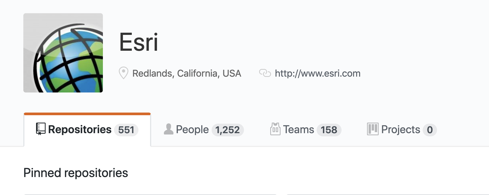

<!-- .slide: data-background="../img/2021/dev-summit/bg-1.png" data-background-size="cover -->
<h1 style="text-align: left; font-size: 80px;">ArcGIS API for JavaScript:</h1>
<h2 style="text-align: left; font-size: 60px;">Programming Patterns</h2>
<h2 style="text-align: left; font-size: 60px;">and Fundamentals</h2>
<p style="text-align: left; font-size: 30px;">Tristan Morrison</p>
<p style="text-align: left; font-size: 30px;">René Rubalcava</p>

---

<!-- .slide: data-auto-animate data-background="../img/2021/dev-summit/bg-3.png" data-transition="fade" -->
## What do I get with the 4x JSAPI?

- Simplified and consistent API
- Write apps in ES6 or TypeScript
- Modern browser support
- [Supported in 30+ locales](http://www.arcgis.com/apps/3DInsetMap/index.html?locale=ja)

---

<!-- .slide: data-auto-animate data-background="../img/2021/dev-summit/bg-2.png" data-transition="fade" -->
## What are my options?

- Needs?
- Resources?
- Time?
- Customizations?

---

<!-- .slide: data-auto-animate data-background="../img/2021/dev-summit/bg-2.png" data-transition="fade" -->
## Why start from scratch?

- App starters
- Widgets

[](https://github.com/search?o=desc&q=topic%3Ajavascript+org%3AEsri+fork%3Atrue&s=updated&type=Repositories)


---

<!-- .slide: data-auto-animate data-background="../img/2021/dev-summit/bg-3.png" data-transition="fade" -->
## Widgets!
- We'll look at a few <a href="(https://developers.arcgis.com/javascript/latest/sample-code/index.html?search=Widget)">widgets</a>
- ~30 Widgets out of the box <!-- .element: class="fragment" data-fragment-index="1" -->
- Widgets help make great apps <!-- .element: class="fragment" data-fragment-index="2" -->
- Less code for you to write <!-- .element: class="fragment" data-fragment-index="3" -->
- Designed with responsive apps in mind <!-- .element: class="fragment" data-fragment-index="4" -->

---

<!-- .slide: data-auto-animate data-background="../img/2021/dev-summit/bg-2.png" data-transition="fade" -->
## Widgets - Expand
 - [Clickable button to open container](https://codepen.io/kellyhutchins/pen/drOGNJ)
 - Icons
 - Group
 - Mode
<aside class="notes">Look at a few key widgets start with expand and point out common questions/gotchas </aside>

---

<!-- .slide: data-auto-animate data-background="../img/2021/dev-summit/bg-2.png" data-transition="fade" -->
## Widgets - Use Portal Content

 - [Search](https://codepen.io/kellyhutchins/pen/EMNPmZ)
 - Basemap Gallery
<aside class="notes">Show how we can provide portal and widgets like search and bmg use that content.  </aside>

---

<!-- .slide: data-auto-animate data-background="../img/2021/dev-summit/bg-2.png" data-transition="fade" -->
## Widgets - Popup
 - [Menu actions](https://developers.arcgis.com/javascript/latest/sample-code/sandbox/index.html?sample=popup-actions)
 - [Dock](https://developers.arcgis.com/javascript/latest/sample-code/sandbox/index.html?sample=popup-docking-position)
<aside class="notes">   </aside>

---

<!-- .slide: data-auto-animate data-background="../img/2021/dev-summit/bg-2.png" data-transition="fade" -->
## Widgets - Popup Template
 - Define fields, charts, custom html content
 - [Using a function](https://developers.arcgis.com/javascript/latest/sample-code/sandbox/index.html?sample=popuptemplate-promise)
 - Promises
 - Arcade

<aside class="notes"> Talk about different ways to define/set popup content</aside>

---

<!-- .slide: data-auto-animate data-background="../img/2021/dev-summit/bg-2.png" data-transition="fade" -->
## Widgets - Author popup in online
 - [Web Map or Web Scene](http://jsapi.maps.arcgis.com/home/webmap/viewer.html?webmap=e9e5311ac8ec4110abe77b026ce87cf7)
 - Layer.fromPortalItem
 - [App Demo](http://www.arcgis.com/apps/Media/index.html?appid=ba47f08a73e142908475b841e0e38b02)
<aside class="notes">Popups can be lots of work to define field info etc. If you use web map, scene, layer you get popup (and rendering) info for free</aside>

---

<!-- .slide: data-auto-animate data-background="../img/2021/dev-summit/bg-2.png" data-transition="fade" -->
## Widgets - Feature
 - Display popup template content
 - [Hover](https://developers.arcgis.com/javascript/latest/sample-code/sandbox/index.html?sample=widgets-feature)
<aside class="notes">Display popup content someplace else</aside>

---

<!-- .slide: data-auto-animate data-background="../img/2021/dev-summit/bg-2.png" data-transition="fade" -->
## Widgets - Architecture

 View + View Model
 

<aside class="notes"> Separate business logic and presentation. Link to doc  </aside>

---

<!-- .slide: data-auto-animate data-background="../img/2021/dev-summit/bg-3.png" data-transition="fade" -->
## View Models

 - [Custom View](https://developers.arcgis.com/javascript/latest/sample-code/sandbox/index.html?sample=widgets-frameworks-react)
 - [Use the view model](https://developers.arcgis.com/example-apps/nearby-javascript/?utm_source=github&utm_campaign=example_apps_nearby_javascript)
  - [Additional Examples](https://odoe.net/blog/view-models-in-the-arcgis-api-for-javascript/)

---

<!-- .slide: data-auto-animate data-background="../img/2021/dev-summit/bg-2.png" data-transition="fade" -->
## Geocoding

```js
const locator = new Locator({ url: url });
locator.addressToLocations({
  address: {
    "singleLine": "380 New York St, Redlands, CA 92373"
  }
});
locator.locationToAddress({ location: point });
```

---

<!-- .slide: data-auto-animate data-background="../img/2021/dev-summit/bg-2.png" data-transition="fade" -->
## Geocoding

```js
const searchVM = new SearchVM();
searchVM.search("380 New York St, Redlands, CA 92373");
searchVM.search(location);
```

---

<!-- .slide: data-auto-animate data-background="../img/2021/dev-summit/bg-2.png" data-transition="fade" -->
## Geocoding

```js
const portal = new Portal(...);
await portal.load();
portal.helperServices.geocode.map(geocoderService => {
  // objects with details on
  // geocode services for your portal
});
```

---

<!-- .slide: data-auto-animate data-background="../img/2021/dev-summit/bg-3.png" data-transition="fade" -->
## Widgets - Styling
 Available Themes
 <iframe  width='500' height='400' scrolling='no' title='Themes' src='//codepen.io/kellyhutchins/embed/preview/Lqebdm/?height=300&theme-id=31222&default-tab=js,result&embed-version=2' frameborder='no' allowtransparency='true' allowfullscreen='true' style='width: 100%;'>See the Pen <a href='https://codepen.io/kellyhutchins/pen/Lqebdm'>Theme Tester</a> by Kelly Hutchins (<a href='https://codepen.io/kellyhutchins'>@kellyhutchins</a>) on <a href='https://codepen.io'>CodePen</a>.
</iframe>

<aside class="notes">Look at ways to customize appearance of widgets</aside>

---

<!-- .slide: data-auto-animate data-background="../img/2021/dev-summit/bg-2.png" data-transition="fade" -->
## Widgets - Styling
 - CSS Extension language
 - SASS
 - [Theme Utility](https://github.com/jcfranco/jsapi-styles)


<aside class="notes">Demo Franco's SASS utility (npm install and show code)</aside>

---

<!-- .slide: data-auto-animate data-background="../img/2021/dev-summit/bg-3.png" data-transition="fade" -->
## Map and View

---

<!-- .slide: data-auto-animate data-background="../img/2021/dev-summit/bg-2.png" data-transition="fade" -->
## Map and View

```js
const map = new Map({
  basemap: "topo"
});

const mView = new MapView({
  map: map,
  container: "viewDiv"
});
const sView = new SceneView({
  map: map,
  container: "viewDiv"
});
```

---

<!-- .slide: data-auto-animate data-background="../img/2021/dev-summit/bg-2.png" data-transition="fade" -->
## Basemaps and Ground

- Convenience Strings

```js
const map = new Map({
  /*
   streets, satellite, hybrid, terrain, topo, gray,
   dark-gray, oceans, national-geographic, osm,
   dark-gray-vector, gray-vector, streets-vector, topo-vector,
   streets-night-vector, streets-relief-vector, streets-navigation-vector
   */
  basemap: "streets"

  /*
   world-elevation
   */
  ground: "world-elevation"
});
```

---

<!-- .slide: data-auto-animate data-background="../img/2021/dev-summit/bg-2.png" data-transition="fade" -->
## Basemaps and Ground

```js
const map = new Map({
  basemap: {
    // Layers drawn at the bottom
    baseLayers: [
      new TileLayer({ url: baselayer })
    ],
    // Layers drawn on top
    referenceLayers: [
      new TileLayer({ url: refUrl })
    ],
  },
  ground: {
    layers: [
      new ElevationLayer({ url: elevationUrl })
    ]
  }
});
```

---

<!-- .slide: data-auto-animate data-background="../img/2021/dev-summit/bg-4.png" data-transition="fade" -->
## Basemap and Ground

<iframe height='500' scrolling='no' title='VT Basemaps' src='//codepen.io/odoe/embed/preview/rpQOEM/?height=300&theme-id=31222&default-tab=js,result&embed-version=2' frameborder='no' allowtransparency='true' allowfullscreen='true' style='width: 100%;'>See the Pen <a href='https://codepen.io/odoe/pen/rpQOEM/'>VT Basemaps</a> by Rene Rubalcava (<a href='https://codepen.io/odoe'>@odoe</a>) on <a href='https://codepen.io'>CodePen</a>.
</iframe>

---

<!-- .slide: data-auto-animate data-background="../img/2021/dev-summit/bg-3.png" data-transition="fade" -->
## Collections

- [`esri/core/Collection`](https://developers.arcgis.com/javascript/latest/api-reference/esri-core-Collection.html)

<iframe height="400" style="width: 100%;" scrolling="no" title="Collection" src="//codepen.io/odoe/embed/preview/MQWLwO/?height=300&theme-id=31222&default-tab=js,result" frameborder="no" allowtransparency="true" allowfullscreen="true">
  See the Pen <a href='https://codepen.io/odoe/pen/MQWLwO/'>Collection</a> by Rene Rubalcava
  (<a href='https://codepen.io/odoe'>@odoe</a>) on <a href='https://codepen.io'>CodePen</a>.
</iframe>

---

<!-- .slide: data-auto-animate data-background="../img/2021/dev-summit/bg-3.png" data-transition="fade" -->
## Working with Accessor

- Objects are have properties that can be:
  - read and set
  - or read-only
  - constructor arguments
  - watchable

---

<!-- .slide: data-auto-animate data-background="../img/2021/dev-summit/bg-2.png" data-transition="fade" -->
### Accessor - property access

```ts
layer.opacity = 0.5;
layer.title = "My test layer";

// setting multiple values
layer.set({
  opacity: 0.5,
  title: "My test layer"
});

// accessing the value of a deep property
view.get("map.basemap.title");
view.set("map.basemap.title", "new title");
```

---

<!-- .slide: data-auto-animate data-background="../img/2021/dev-summit/bg-2.png" data-transition="fade" -->
### Accessor - property watching

```ts
mapView.watch("scale", (newValue, oldValue, property, target) => {
  console.log(`scale changed: ${newValue}`);
});


mapView.watch("map.basemap.title", (newValue, oldValue, property, target) => {
  console.log(`new basemap title: ${newValue}`);
});


mapView.watch("ready, stationary", (newValue, oldValue, property, target) => {
  console.log(`property ${property}: ${newValue}`);
});

watchUtils.whenTrue(view, "stationary", () => {
  console.log("view is stationary");
})
```

[watchUtils](https://developers.arcgis.com/javascript/latest/api-reference/esri-core-watchUtils.html)

---

<!-- .slide: data-auto-animate data-background="../img/2021/dev-summit/bg-2.png" data-transition="fade" -->
### Accessor - autocasting and single constructor

```js
  // 4.x
  {
    type: "simple-marker",
    style: 'square',
    color: 'red',
    size: 10,
    outline: {
      color: 'rgba(255, 255, 255, 0.5)'
      width: 4
    }
  });

  // 3.x
  new SimpleMarkerSymbol(SimpleMarkerSymbol.STYLE_SQUARE, 10,
    new SimpleLineSymbol(SimpleLineSymbol.STYLE_SOLID,
    new Color([255,0,0]), 4),
    new Color([255,255,255,0.25]));
```

---

<!-- .slide: data-auto-animate data-background="../img/2021/dev-summit/bg-3.png" data-transition="fade" -->
## Promises

---

<!-- .slide: data-auto-animate data-background="../img/2021/dev-summit/bg-2.png" data-transition="fade" -->
## Promises

- All asynchronous methods return a promise, no more [events](https://developers.arcgis.com/javascript/jsapi/querytask-amd.html#events)
- The basic pattern looks like this:

```js
layer.queryFeatures(query).then(handleResult).catch(handleError);
```

---

<!-- .slide: data-auto-animate data-background="../img/2021/dev-summit/bg-2.png" data-transition="fade" -->
## Promises with async/await

- work with native promises

```js
const doQuery = async (query) => {
  const results = await layer.queryFeatures(query);
  const transformedResults = results.map(transformData);
  return transformedResults;
}
```

---

<!-- .slide: data-auto-animate data-background="../img/2021/dev-summit/bg-2.png" data-transition="fade" -->
## Promises

- Load resources
- Asychronously initialized `Layer`, `WebMap`, `WebScene`, `View`

```js
const map = new Map({...})

view = new SceneView({
  map: map,
  //...
});

view.when(() => {
  // the view is ready to go
});
```

---

<!-- .slide: data-auto-animate data-background="../img/2021/dev-summit/bg-2.png" data-transition="fade" -->
## Promises

```js
view.when(() => {
  return view.whenLayerView(map.findLayerById("awesomeLayer"));
})
.then(layerView => {
  return watchUtils.whenFalseOnce(layerView, "updating");
})
.then(result => {
  const layerView = result.target;
  return layerView.queryFeatures();
})
.then(doSomethingWithFeatures)
.catch(errorHandler);
```

[API sample](https://developers.arcgis.com/javascript/latest/sample-code/chaining-promises/index.html)

---

<!-- .slide: data-auto-animate data-background="../img/2021/dev-summit/bg-2.png" data-transition="fade" -->
## async/await

```js
const init = async (doSomethingWithFeatures) => {
  await view.when();
  const layerView = await view.whenLayerView(map.findLayerById("awesomeLayer"));
  const { target as layerView } = await watchUtils.whenFalseOnce(layerView, "updating");
  const features = await layerView.queryFeatures();
  doSomethingWithFeatures(features);
};

try {
  init();
}
catch(error) {
  errorHandler(error);
}

```

---

<!-- .slide: data-auto-animate data-background="../img/2021/dev-summit/bg-3.png" data-transition="fade" -->
## Patterns

---

<!-- .slide: data-auto-animate data-background="../img/2021/dev-summit/bg-2.png" data-transition="fade" -->
## Interactivity with view events

- Use view events to interact with the view
- [List of events](https://developers.arcgis.com/javascript/latest/api-reference/esri-views-MapView.html#events-summary)
- You can stop the propagation of the event to prevent the default behavior

```js
view.on("drag", event => {
  // user won't be able to drag
  event.stopPropagation();
})
```

---

<!-- .slide: data-auto-animate data-background="../img/2021/dev-summit/bg-2.png" data-transition="fade" -->
## Interactivity with view events

- Access the features on click

```js
view.on("click", ({ x, y }) => {
  const screenPoint = {x, y};
  view.hitTest(screenPoint)
    .then(response => {
       // do something with the result graphic
       const graphic = response.results[0].graphic;
    });
});
```
- [API Sample](https://developers.arcgis.com/javascript/latest/sample-code/sandbox/index.html?sample=view-hittest)

---

<!-- .slide: data-auto-animate data-background="../img/2021/dev-summit/bg-2.png" data-transition="fade" -->
## goTo() with View

- Sets the view to a given target.
  - Navigate to a geometry/feature/location
- [API Sample](https://developers.arcgis.com/javascript/latest/sample-code/sandbox/index.html?sample=scene-goto)

---

<!-- .slide: data-auto-animate data-background="../img/2021/dev-summit/bg-3.png" data-transition="fade" -->
## Loadables

- brings better control, and scheduling of loading resources.
- extension of `esri/core/Promise`
- in 3.x, instanciating a layer loads it. in 4.0, it's an explicit call
- the views automatically loads the map and its layers

---

<!-- .slide: data-auto-animate data-background="../img/2021/dev-summit/bg-2.png" data-transition="fade" -->
## Loadables

- `WebMap` / `WebScene` need to load:
 - the portal item
 - the layer module
 - the layer's item
- `MapView` / `SceneView` need to load:
 - the map
 - the layers

---

<!-- .slide: data-auto-animate data-background="../img/2021/dev-summit/bg-2.png" data-transition="fade" -->
```js
  //In a single page application, get a feature from a FeatureLayer from a WebMap without displaying it, ASAP!
  const webmap = new WebMap({
    portalItem: {
      id: 'affa021c51944b5694132b2d61fe1057'
    }
  });

  webmap.load()
    .then(() => {
      return webmap.getLayer('myFeatureLayerId').load();
    })
    .then(featureLayer => {
      return featureLayer.queryFeatures({
        where: 'OBJECTID = 1'
      });
    })
    .then(result => {
      displayDetails(result.features[0]);
    })
    .otherwise(error => {
      console.error(error);
    });
```

---

<!-- .slide: data-auto-animate data-background="../img/2021/dev-summit/bg-3.png" data-transition="fade" -->
## Zoom or Scale

```js
const view = new MapView({
  container: "viewDiv",
  map: map,
  center: [-116.5, 33.80],
  zoom: 14 // what does that really mean?
});
```

- Zoom = LOD (Level of Details)
- Not all LODs are created equal

---

<!-- .slide: data-auto-animate data-background="../img/2021/dev-summit/bg-2.png" data-transition="fade" -->
## Zoom is not Scale

```js
const view = new MapView({
  container: "viewDiv",
  map: map,
  center: [-116.5, 33.80],
  scale: 50000 // I know what that means!
});
```

- Scale is portable
- Scale has meaning
- We still snap to closest LOD/zoom

---

<!-- .slide: data-auto-animate data-background="../img/2021/dev-summit/bg-2.png" data-transition="fade" -->
## WebMap is still a Map

```js
const map = new WebMap({
  basemap: { ... },
  layers: [ ... ]
});
```

- Still acts like a regular `Map`
- Has some advantages

---

<!-- .slide: data-auto-animate data-background="../img/2021/dev-summit/bg-4.png" data-transition="fade" -->
## WebMap is still a Map

<iframe height='500' scrolling='no' title='Local bookmarks' src='//codepen.io/odoe/embed/preview/QxrEVX/?height=500&theme-id=31222&default-tab=js,result&embed-version=2' frameborder='no' allowtransparency='true' allowfullscreen='true' style='width: 100%;'>See the Pen <a href='https://codepen.io/odoe/pen/QxrEVX/'>Local bookmarks</a> by Rene Rubalcava (<a href='https://codepen.io/odoe'>@odoe</a>) on <a href='https://codepen.io'>CodePen</a>.
</iframe>

---

<!-- .slide: data-auto-animate data-background="../img/2021/dev-summit/bg-3.png" data-transition="fade" -->
## Sublayer to FeatureLayer

- You can extract a FeatureLayer from MapImageLayer Sublayer
- `sublayer.createFeatureLayer()`
- Can use capabilities not normally available with Sublayer

---

<!-- .slide: data-auto-animate data-background="../img/2021/dev-summit/bg-4.png" data-transition="fade" -->
## Sublayer to FeatureLayer

<iframe height='500' scrolling='no' title='createFeatureLayer' src='//codepen.io/odoe/embed/preview/PaxeyO/?height=500&theme-id=31222&default-tab=js,result&embed-version=2' frameborder='no' allowtransparency='true' allowfullscreen='true' style='width: 100%;'>See the Pen <a href='https://codepen.io/odoe/pen/PaxeyO/'>createFeatureLayer</a> by Rene Rubalcava (<a href='https://codepen.io/odoe'>@odoe</a>) on <a href='https://codepen.io'>CodePen</a>.
</iframe>

---

<!-- .slide: data-auto-animate data-background="../img/2021/dev-summit/bg-3.png" data-transition="fade" -->
## createQuery

- When you can do `layer.createQuery()`
  - `query` object will already have the layers filters and layer definitions
  - more consistent
- Use `new Query()` when you don't want predefined filters to be applied

---

<!-- .slide: data-auto-animate data-background="../img/2021/dev-summit/bg-4.png" data-transition="fade" -->
## createQuery

<iframe height='500' scrolling='no' title='createQuery' src='//codepen.io/odoe/embed/preview/rKQqQW/?height=500&theme-id=31222&default-tab=js,result&embed-version=2' frameborder='no' allowtransparency='true' allowfullscreen='true' style='width: 100%;'>See the Pen <a href='https://codepen.io/odoe/pen/rKQqQW/'>createQuery</a> by Rene Rubalcava (<a href='https://codepen.io/odoe'>@odoe</a>) on <a href='https://codepen.io'>CodePen</a>.
</iframe>

---

<!-- .slide: data-auto-animate data-background="../img/2021/dev-summit/bg-3.png" data-transition="fade" -->
## MapImageLayer

- If you want to modify Sublayers, do it after you load the layer
- Defining them upfront overrides the defaults
  - May not be what you want

---

<!-- .slide: data-auto-animate data-background="../img/2021/dev-summit/bg-4.png" data-transition="fade" -->
## MapImageLayer

<iframe height='500' scrolling='no' title='MapImageLayer - Load Sublayers' src='//codepen.io/odoe/embed/preview/WyYBwL/?height=500&theme-id=31222&default-tab=js,result&embed-version=2' frameborder='no' allowtransparency='true' allowfullscreen='true' style='width: 100%;'>See the Pen <a href='https://codepen.io/odoe/pen/WyYBwL/'>MapImageLayer - Load Sublayers</a> by Rene Rubalcava (<a href='https://codepen.io/odoe'>@odoe</a>) on <a href='https://codepen.io'>CodePen</a>.
</iframe>

---

<!-- .slide: data-auto-animate data-background="../img/2021/dev-summit/bg-3.png" data-transition="fade" -->
## LayerViews

- Renders the Layer
- When is it done though?
  - _hotly debated topic!_
  - When can you actually use it!!
  - Behavior different with optimized FeatureLayer

---

<!-- .slide: data-auto-animate data-background="../img/2021/dev-summit/bg-4.png" data-transition="fade" -->
## LayerViews

<iframe height='500' scrolling='no' title='LayerView - Ready' src='//codepen.io/odoe/embed/preview/YvRJgj/?height=500&theme-id=31222&default-tab=js,result&embed-version=2' frameborder='no' allowtransparency='true' allowfullscreen='true' style='width: 100%;'>See the Pen <a href='https://codepen.io/odoe/pen/YvRJgj/'>LayerView - Ready</a> by Rene Rubalcava (<a href='https://codepen.io/odoe'>@odoe</a>) on <a href='https://codepen.io'>CodePen</a>.
</iframe>

---

<!-- .slide: data-auto-animate data-background="../img/2021/dev-summit/bg-4.png" -->
## Summary

---

<!-- .slide: data-auto-animate data-background="../img/2021/dev-summit/bg-5.png" -->


