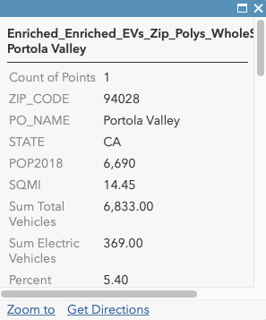

<!-- .slide: data-background="../img/2021/dev-summit/bg-1.png" data-background-size="cover -->
<h1 style="text-align: left; font-size: 70px; top: 143px">ArcGIS API for JavaScript:</h1>
<h2 style="text-align: left; font-size: 51px; font-weight: bold">Programming Patterns and API Fundamentals</h2>
<p style="text-align: left; font-size: 30px; margin-top: 80px; margin-bottom: 0">Tristan Morrison</p>
<p style="text-align: left; font-size: 30px; margin-top: 5px">René Rubalcava</p>

---

<!-- .slide: data-auto-animate data-background="../img/2021/dev-summit/bg-2.png" data-transition="fade" -->
## Why choose the ArcGIS JS API?

<ul style="font-size: 36px">
  <li class="fragment">Seamless interfaces to ArcGIS Platform</li>
  <li class="fragment">Client-side analysis</li>
  <li class="fragment">Rich, interactive data visualizations powered by WebGL</li>
  <li class="fragment">2D & 3D in one API</li>
  <li class="fragment">Widgets help rapidly build a professional, well-tested UI</li>
</ul>

@Notes
* Strong consistency between 2D and 3D
* Consistent interfaces to whole range of ArcGIS Platform services
* Client-side analysis

---

<!-- .slide: data-auto-animate data-background="../img/2021/dev-summit/bg-3.png" data-transition="fade" -->
## Map and View

---

<!-- .slide: data-auto-animate data-background="../img/2021/dev-summit/bg-2.png" data-transition="fade" -->
## Map and View

```js
const map = new Map({
  basemap: "topo"
});

const mView = new MapView({
  map: map,
  container: "viewDiv"
});
const sView = new SceneView({
  map: map,
  container: "viewDiv"
});
```

---

<!-- .slide: data-auto-animate data-background="../img/2021/dev-summit/bg-2.png" data-transition="fade" -->
## Basemaps and Ground

- Convenience Strings

```js
const map = new Map({
  /*
   streets, satellite, hybrid, terrain, topo, gray,
   dark-gray, oceans, national-geographic, osm,
   dark-gray-vector, gray-vector, streets-vector, topo-vector,
   streets-night-vector, streets-relief-vector, streets-navigation-vector
   */
  basemap: "streets"

  /*
   world-elevation
   */
  ground: "world-elevation"
});
```

---

<!-- .slide: data-auto-animate data-background="../img/2021/dev-summit/bg-2.png" data-transition="fade" -->
## Basemaps and Ground

```js
const map = new Map({
  basemap: {
    // Layers drawn at the bottom
    baseLayers: [
      new TileLayer({ url: baselayer })
    ],
    // Layers drawn on top
    referenceLayers: [
      new TileLayer({ url: refUrl })
    ],
  },
  ground: {
    layers: [
      new ElevationLayer({ url: elevationUrl })
    ]
  }
});
```

---

<!-- .slide: data-auto-animate data-background="../img/2021/dev-summit/bg-3.png" data-transition="fade" -->
## Basemap and Ground

<iframe height='500' scrolling='no' title='VT Basemaps' src='//codepen.io/odoe/embed/preview/rpQOEM/?height=300&theme-id=31222&default-tab=js,result&embed-version=2' frameborder='no' allowtransparency='true' allowfullscreen='true' style='width: 100%;'>See the Pen <a href='https://codepen.io/odoe/pen/rpQOEM/'>VT Basemaps</a> by Rene Rubalcava (<a href='https://codepen.io/odoe'>@odoe</a>) on <a href='https://codepen.io'>CodePen</a>.
</iframe>

---

<!-- .slide: data-auto-animate data-background="../img/2021/dev-summit/bg-3.png" data-transition="fade" -->
## Collections

- [`esri/core/Collection`](https://developers.arcgis.com/javascript/latest/api-reference/esri-core-Collection.html)

<iframe height="400" style="width: 100%;" scrolling="no" title="Collection" src="//codepen.io/odoe/embed/preview/MQWLwO/?height=300&theme-id=31222&default-tab=js,result" frameborder="no" allowtransparency="true" allowfullscreen="true">
  See the Pen <a href='https://codepen.io/odoe/pen/MQWLwO/'>Collection</a> by Rene Rubalcava
  (<a href='https://codepen.io/odoe'>@odoe</a>) on <a href='https://codepen.io'>CodePen</a>.
</iframe>

---

<!-- .slide: data-auto-animate data-background="../img/2021/dev-summit/bg-3.png" data-transition="fade" -->
## Working with Accessor

- Objects are have properties that can be:
  - read and set
  - or read-only
  - constructor arguments
  - watchable

---

<!-- .slide: data-auto-animate data-background="../img/2021/dev-summit/bg-2.png" data-transition="fade" -->
### Accessor - property access

```ts
layer.opacity = 0.5;
layer.title = "My test layer";

// setting multiple values
layer.set({
  opacity: 0.5,
  title: "My test layer"
});

// accessing the value of a deep property
view.get("map.basemap.title");
view.set("map.basemap.title", "new title");
```

---

<!-- .slide: data-auto-animate data-background="../img/2021/dev-summit/bg-2.png" data-transition="fade" -->
### Accessor - property watching

```ts
mapView.watch("scale", (newValue, oldValue, property, target) => {
  console.log(`scale changed: ${newValue}`);
});


mapView.watch("map.basemap.title", (newValue, oldValue, property, target) => {
  console.log(`new basemap title: ${newValue}`);
});


mapView.watch("ready, stationary", (newValue, oldValue, property, target) => {
  console.log(`property ${property}: ${newValue}`);
});

watchUtils.whenTrue(view, "stationary", () => {
  console.log("view is stationary");
})
```

[watchUtils](https://developers.arcgis.com/javascript/latest/api-reference/esri-core-watchUtils.html)

---

<!-- .slide: data-auto-animate data-background="../img/2021/dev-summit/bg-2.png" data-transition="fade" -->
### Accessor - autocasting and single constructor

```js
  {
    type: "simple-marker",
    style: 'square',
    color: 'red',
    size: 10,
    outline: {
      color: 'rgba(255, 255, 255, 0.5)'
      width: 4
    }
  });
```

---

<!-- .slide: data-auto-animate data-background="../img/2021/dev-summit/bg-3.png" data-transition="fade" -->
## Promises

---

<!-- .slide: data-auto-animate data-background="../img/2021/dev-summit/bg-2.png" data-transition="fade" -->
## Promises

- All asynchronous methods return a native promise
- The basic pattern looks like this:

```js
layer.queryFeatures(query)
	.then(handleResult).catch(handleError);
```

---

<!-- .slide: data-auto-animate data-background="../img/2021/dev-summit/bg-2.png" data-transition="fade" -->
## Promises with async/await

```js
const doQuery = async (query) => {
  const results = await layer.queryFeatures(query);
  const transformedResults = results.map(transformData);
  return transformedResults;
}
```

---

<!-- .slide: data-auto-animate data-background="../img/2021/dev-summit/bg-2.png" data-transition="fade" -->
## Dynamic Imports

```js
async function loadMap(id) {
  const { default: WebMap } =
	await import('@arcgis/core/WebMap');
  return new WebMap({
    portalItem: { id }
  });
}
```

---

<!-- .slide: data-auto-animate data-background="../img/2021/dev-summit/bg-2.png" data-transition="fade" -->
## Promises

- Load resources
- Asynchronously initialized `Layer`, `WebMap`, `WebScene`, `View`

```js
const map = new Map({...})

view = new SceneView({
  map: map,
  //...
});

view.when(() => {
  // the view is ready to go
});
```

---

<!-- .slide: data-auto-animate data-background="../img/2021/dev-summit/bg-2.png" data-transition="fade" -->
## Promises

```js
view.when(() => {
  return view.whenLayerView(map.findLayerById("awesomeLayer"));
})
.then(layerView => {
  return watchUtils.whenFalseOnce(layerView, "updating");
})
.then(result => {
  const layerView = result.target;
  return layerView.queryFeatures();
})
.then(doSomethingWithFeatures)
.catch(errorHandler);
```

[API sample](https://developers.arcgis.com/javascript/latest/sample-code/chaining-promises/index.html)

---

<!-- .slide: data-auto-animate data-background="../img/2021/dev-summit/bg-2.png" data-transition="fade" -->
## async/await

```js
const init = async (doSomethingWithFeatures) => {
  await view.when();
  const layerView =
	await view.whenLayerView(map.findLayerById("awesomeLayer"));
  await watchUtils.whenFalseOnce(layerView, "updating");
  const features = await layerView.queryFeatures();
  doSomethingWithFeatures(features);
};

try {
  init();
}
catch(error) {
  errorHandler(error);
}

```

---

<!-- .slide: data-auto-animate data-background="../img/2021/dev-summit/bg-3.png" data-transition="fade" -->
## Patterns

---

<!-- .slide: data-auto-animate data-background="../img/2021/dev-summit/bg-2.png" data-transition="fade" -->
## Interactivity with view events

- Use view events to interact with the view
- [List of events](https://developers.arcgis.com/javascript/latest/api-reference/esri-views-MapView.html#events-summary)
- You can stop the propagation of the event to prevent the default behavior

```js
view.on("drag", event => {
  // user won't be able to drag
  event.stopPropagation();
})
```

---

<!-- .slide: data-auto-animate data-background="../img/2021/dev-summit/bg-2.png" data-transition="fade" -->
## Interactivity with view events

- Access the features on click

```js
view.on("click", ({ x, y }) => {
  const screenPoint = {x, y};
  view.hitTest(screenPoint)
    .then(response => {
       // do something with the result graphic
       const graphic = response.results[0].graphic;
    });
});
```
- [API Sample](https://developers.arcgis.com/javascript/latest/sample-code/sandbox/index.html?sample=view-hittest)

---

<!-- .slide: data-auto-animate data-background="../img/2021/dev-summit/bg-2.png" data-transition="fade" -->
## goTo() with View

- Sets the view to a given target.
  - Navigate to a geometry/feature/location
- [API Sample](https://developers.arcgis.com/javascript/latest/sample-code/sandbox/index.html?sample=scene-goto)

---

<!-- .slide: data-auto-animate data-background="../img/2021/dev-summit/bg-2.png" data-transition="fade" -->
## Loadables

- brings better control, and scheduling of loading resources.
- the views automatically loads the map and its layers

---

<!-- .slide: data-auto-animate data-background="../img/2021/dev-summit/bg-2.png" data-transition="fade" -->
## Loadables

- `WebMap` / `WebScene` need to load:
  - the portal item
  - the layer module
  - the layer's item

- `MapView` / `SceneView` need to load:
  - the map
  - the layers

---

<!-- .slide: data-auto-animate data-background="../img/2021/dev-summit/bg-3.png" data-transition="fade" -->
```js
  // In a single page application, get a feature from a FeatureLayer
  // from a WebMap without displaying it, ASAP!
  const webmap = new WebMap({
    portalItem: {
      id: 'affa021c51944b5694132b2d61fe1057'
    }
  });

  webmap.load()
    .then(() => {
      return webmap.findLayerById('myFeatureLayerId').load();
    })
    .then(featureLayer => {
      return featureLayer.queryFeatures({
        where: 'OBJECTID = 1'
      });
    })
    .then(result => {
      displayDetails(result.features[0]);
    })
    .catch(error => {
      console.error(error);
    });
```

---

<!-- .slide: data-auto-animate data-background="../img/2021/dev-summit/bg-3.png" data-transition="fade" -->
## Zoom or Scale

```js
const view = new MapView({
  container: "viewDiv",
  map: map,
  center: [-116.5, 33.80],
  zoom: 14 // what does that really mean?
});
```

- Zoom = LOD (Level of Details)
- Not all LODs are created equal

---

<!-- .slide: data-auto-animate data-background="../img/2021/dev-summit/bg-2.png" data-transition="fade" -->
## Zoom is not Scale

```js
const view = new MapView({
  container: "viewDiv",
  map: map,
  center: [-116.5, 33.80],
  scale: 50000 // I know what that means!
});
```

- Scale is portable
- Scale has meaning
- We still snap to closest LOD/zoom

---

<!-- .slide: data-auto-animate data-background="../img/2021/dev-summit/bg-3.png" data-transition="fade" -->
## Sublayer to FeatureLayer

- You can extract a FeatureLayer from MapImageLayer Sublayer
- `sublayer.createFeatureLayer()`
- Can use capabilities not normally available with Sublayer

---

<!-- .slide: data-auto-animate data-background="../img/2021/dev-summit/bg-4.png" data-transition="fade" -->
## Sublayer to FeatureLayer

<iframe height='500' scrolling='no' title='createFeatureLayer' src='//codepen.io/odoe/embed/preview/PaxeyO/?height=500&theme-id=31222&default-tab=js,result&embed-version=2' frameborder='no' allowtransparency='true' allowfullscreen='true' style='width: 100%;'>See the Pen <a href='https://codepen.io/odoe/pen/PaxeyO/'>createFeatureLayer</a> by Rene Rubalcava (<a href='https://codepen.io/odoe'>@odoe</a>) on <a href='https://codepen.io'>CodePen</a>.
</iframe>

---

<!-- .slide: data-auto-animate data-background="../img/2021/dev-summit/bg-2.png" data-transition="fade" -->
## createQuery

- When you can do `layer.createQuery()`
  - `query` object will already have the layers filters and layer definitions
  - more consistent
- Use `new Query()` when you don't want predefined filters to be applied

---

<!-- .slide: data-auto-animate data-background="../img/2021/dev-summit/bg-4.png" data-transition="fade" -->
## createQuery

<iframe height='500' scrolling='no' title='createQuery' src='//codepen.io/odoe/embed/preview/rKQqQW/?height=500&theme-id=31222&default-tab=js,result&embed-version=2' frameborder='no' allowtransparency='true' allowfullscreen='true' style='width: 100%;'>See the Pen <a href='https://codepen.io/odoe/pen/rKQqQW/'>createQuery</a> by Rene Rubalcava (<a href='https://codepen.io/odoe'>@odoe</a>) on <a href='https://codepen.io'>CodePen</a>.
</iframe>

---

<!-- .slide: data-auto-animate data-background="../img/2021/dev-summit/bg-3.png" data-transition="fade" -->
## MapImageLayer

- If you want to modify Sublayers, do it after you load the layer
- Defining them upfront overrides the defaults
  - May not be what you want

---

<!-- .slide: data-auto-animate data-background="../img/2021/dev-summit/bg-4.png" data-transition="fade" -->
## MapImageLayer

<iframe height='500' scrolling='no' title='MapImageLayer - Load Sublayers' src='//codepen.io/odoe/embed/preview/WyYBwL/?height=500&theme-id=31222&default-tab=js,result&embed-version=2' frameborder='no' allowtransparency='true' allowfullscreen='true' style='width: 100%;'>See the Pen <a href='https://codepen.io/odoe/pen/WyYBwL/'>MapImageLayer - Load Sublayers</a> by Rene Rubalcava (<a href='https://codepen.io/odoe'>@odoe</a>) on <a href='https://codepen.io'>CodePen</a>.
</iframe>

---

<!-- .slide: data-auto-animate data-background="../img/2021/dev-summit/bg-3.png" data-transition="fade" -->
## LayerViews

- Renders the Layer
- When is it done though?
  - When can you actually use it!!

---

<!-- .slide: data-auto-animate data-background="../img/2021/dev-summit/bg-4.png" data-transition="fade" -->
## LayerViews

<iframe height='500' scrolling='no' title='LayerView - Ready' src='//codepen.io/odoe/embed/preview/YvRJgj/?height=500&theme-id=31222&default-tab=js,result&embed-version=2' frameborder='no' allowtransparency='true' allowfullscreen='true' style='width: 100%;'>See the Pen <a href='https://codepen.io/odoe/pen/YvRJgj/'>LayerView - Ready</a> by Rene Rubalcava (<a href='https://codepen.io/odoe'>@odoe</a>) on <a href='https://codepen.io'>CodePen</a>.
</iframe>

---

<!-- .slide: data-auto-animate data-background="../img/2021/dev-summit/bg-3.png" data-transition="fade" -->
## Renderers
- Specifies how a layer is visualized
- Determines what information will be conveyed through the layer's symbology
- _What story do you want to tell with this layer's data?_

---

<!-- .slide: data-background="../img/2021/dev-summit/bg-2.png" data-transition="fade" -->
## Types of Renderers

<table style="font-size: 28px">
  <tr>
    <th>Visualization Method</th>
    <th>Renderer Class</th>
  </tr>
  <tr>
    <td>Location only</td>
    <td><code>SimpleRenderer</code>,<code> HeatmapRenderer</code></td>
  </tr>
  <tr>
    <td>Unique values</td>
    <td><code>UniqueValueRenderer</code></td>
  </tr>
  <tr>
    <td>Class breaks</td>
    <td><code>ClassBreaksRenderer</code></td>
    </tr>
  <tr>
    <td>Continuous color or size</td>
    <td><code>SimpleRenderer</code> or <code>UniqueValueRenderer</code>, &nbsp;with visual variables</td>
  </tr>
  <tr>
    <td>Multivariate</td>
    <td><code>SimpleRenderer</code> or <code>UniqueValueRenderer</code>, &nbsp;with visual variables</td>
  </tr>
</table>

---

<!-- .slide: data-auto-animate data-background="../img/2021/dev-summit/bg-4.png" data-transition="fade" -->
## Renderers
<iframe height="500" style="width: 100%;" scrolling="no" title="Renderers - DevSummit 2021" src="https://codepen.io/tristan-morrison/embed/eYBgzNX?height=371&theme-id=31222&default-tab=js,result" frameborder="no" loading="lazy" allowtransparency="true" allowfullscreen="true">
  See the Pen <a href='https://codepen.io/tristan-morrison/pen/eYBgzNX'>Renderers - DevSummit 2021</a> by Tristan Morrison
  (<a href='https://codepen.io/tristan-morrison'>@tristan-morrison</a>) on <a href='https://codepen.io'>CodePen</a>.
</iframe>


---

<!-- .slide: data-auto-animate data-background="../img/2021/dev-summit/bg-3.png" data-transition="fade" -->
## Widgets
- Professionally designed and tested building blocks <!-- .element: class="fragment" data-fragment-index="1" -->
- Responsive, accessible, and localized <!-- .element: class="fragment" data-fragment-index="2" -->
- 40+ widgets out of the box + everything you need to build your own <!-- .element: class="fragment" data-fragment-index="3" -->
- Purpose-built for maps-based applications <!-- .element: class="fragment" data-fragment-index="4" -->

@Notes
* Responsive, accessible, and localized: for app developers, these are like doing your taxes or cutting your hair — you _could_ do it; but there are experts who devote their careers to these things who can do them for you, 3 times faster and 5 times better
* The built-in widgets cover a broad range of UI needs. You can probably build 80-90 percent of your UI from these components alone; and for the remaining 10-20 percent, you can build your own widgets and still be able to style them consistently with the rest of your UI
* JavaScript UI kits are a dime a dozen; but our widgets are designed and built specially for maps-based applications using ArcGIS Platform data and services

---

<!-- .slide: data-auto-animate data-background="../img/2021/dev-summit/bg-4.png" data-transition="fade" -->
## Widgets
<iframe height="500" style="width: 100%;" scrolling="no" title="Widgets - DevSummit 2021" src="https://codepen.io/tristan-morrison/embed/YzpGbqP?height=371&theme-id=31222&default-tab=js,result" frameborder="no" loading="lazy" allowtransparency="true" allowfullscreen="true">
  See the Pen <a href='https://codepen.io/tristan-morrison/pen/YzpGbqP'>Widgets - DevSummit 2021</a> by Tristan Morrison
  (<a href='https://codepen.io/tristan-morrison'>@tristan-morrison</a>) on <a href='https://codepen.io'>CodePen</a>.
</iframe>

---

<!-- .slide: data-auto-animate data-background="../img/2021/dev-summit/bg-2.png" data-transition="fade" -->
## Widgets: Popup
<style type="text/css" scoped>
  code {
    width: 753px;
  }
</style>
- Show users information from feature attributes
- All views have a default popup template 
```js
 const view = new MapView({
   map: myMap,
   defaultPopupTemplateEnabled: true //enable default popup
 });
```
@Notes
- Augment the storytelling power of your map layers
- Allow users to explore the data in full detail

---

<!-- .slide: data-auto-animate data-background="../img/2021/dev-summit/bg-2.png" data-transition="fade" -->
Often, database field names are not very user-friendly...


---

<!-- .slide: data-auto-animate data-background="../img/2021/dev-summit/bg-4.png" data-transition="fade" -->
## Widgets - Popup Template
<iframe height="350" style="width: 100%;" scrolling="no" title="PopupTemplate - DevSummit 2021" src="https://codepen.io/tristan-morrison/embed/RwoKJMN?height=371&theme-id=31222&default-tab=js,result" frameborder="no" loading="lazy" allowtransparency="true" allowfullscreen="true">
  See the Pen <a href='https://codepen.io/tristan-morrison/pen/RwoKJMN'>PopupTemplate - DevSummit 2021</a> by Tristan Morrison
  (<a href='https://codepen.io/tristan-morrison'>@tristan-morrison</a>) on <a href='https://codepen.io'>CodePen</a>.
</iframe>

---

<!-- .slide: data-auto-animate data-background="../img/2021/dev-summit/bg-3.png" data-transition="fade" -->
## Widget Architecture

<div style="text-align: left;">
  <p>Widgets have <strong>two components</strong></p>
  <ol>
    <li class="fragment"><strong>View</strong>: responsible for the user interface and listening for user inputs</li>
    <li class="fragment"><strong>View Model</strong>: manages the data structures and business logic for the widget</li>
  </ol>
</div>

---

<!-- .slide: data-auto-animate data-background="../img/2021/dev-summit/bg-3.png" data-transition="fade" -->
## Custom Widgets

<ul>
  <li class="fragment">Use Sass to <a href="https://developers.arcgis.com/javascript/latest/styling/#widget-css">style the built-in widgets</a></li>
  <li class="fragment">Use the view model class of a built-in widget with a custom view class</li>
  <li class="fragment">Start from scratch, with comprehensive <a href="https://developers.arcgis.com/javascript/latest/custom-widget/">documentation</a> and <a href="https://developers.arcgis.com/javascript/latest/sample-code/widgets-custom-widget/">tutorials</a></li>
</ul>

---

<!-- .slide: data-auto-animate data-background="../img/2021/dev-summit/bg-2.png" data-transition="fade" -->
## Plenty to Get You Going

<ul>
  <li>Nearly 300 <a href="https://developers.arcgis.com/javascript/latest/sample-code/">code samples</a></li>
  <li class="fragment">Open source starter apps: <a href="https://developers.arcgis.com/documentation/app-templates-and-builders/open-source-apps/maps-app/">Maps App</a>, <a href="https://developers.arcgis.com/documentation/app-templates-and-builders/open-source-apps/nearby-places/">Nearby Places</a></li>
  <li class="fragment">Low-code and no-code app builders: <a href="https://developers.arcgis.com/documentation/app-templates-and-builders/experience-builder/">Experience Builder</a>, <a href="https://developers.arcgis.com/documentation/app-templates-and-builders/storymaps/">StoryMaps</a>, <a href="https://developers.arcgis.com/documentation/app-templates-and-builders/web-appbuilder/">Web AppBuilder</a>, <a href="https://developers.arcgis.com/documentation/app-templates-and-builders/configurable-apps/">Configurable Apps</a></li>
</ul>

---

<!-- .slide: data-auto-animate data-background="../img/2021/dev-summit/bg-5.png" -->

<p style="margin-top: 145px;">Please provide your feedback for this session by clicking on the session survey link directly below the video.</p>


