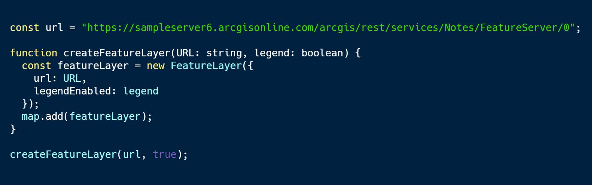

<!-- .slide: data-background="../img/2021/dev-summit/bg-1.png" data-background-size="cover -->
<h1 style="text-align: left; font-size: 80px;">Using TypeScript</h1>
<h2 style="text-align: left; font-size: 60px;">with the ArcGIS API for JavaScript</h2>
<p style="text-align: left; font-size: 30px;">Noah Sager | René Rubalcava</p>
<p style="text-align: left; font-size: 30px;"><a href="https://twitter.com/Noashx">@Noashx</a></p>
<p style="text-align: left; font-size: 30px;"><a href="https://twitter.com/odoenet">@odoenet</a></p>

---

<!-- .slide: data-auto-animate data-background="../img/2021/dev-summit/bg-3.png" -->
## Agenda
</br>

 - What is TypeScript?
 - Why use TypeScript?
 - Setup and First steps
 - Live Action Demo
 - Where can I get more info?

---

<!-- .slide: data-auto-animate data-background="../img/2021/dev-summit/bg-2.png" -->
## What is TypeScript?

<a href="https://www.typescriptlang.org/" target="_blank">

</a>

---

<!-- .slide: data-auto-animate data-background="../img/2021/dev-summit/bg-2.png" -->
## Where do I begin?

<a href="https://www.typescriptlang.org/" target="_blank">

</a>

---

<!-- .slide: data-auto-animate data-background="../img/2021/dev-summit/bg-2.png" -->
## **Developer Setup**

<a href="https://developers.arcgis.com/javascript/latest/guide/typescript-setup/index.html" target="_blank">

</a>

---

<!-- .slide: data-auto-animate data-background="../img/2021/dev-summit/bg-2.png" -->
## **Developer Setup**

<a href="https://developers.arcgis.com/javascript/latest/guide/typescript-setup/index.html" target="_blank">

</a>

---

<!-- .slide: data-auto-animate data-background="../img/2021/dev-summit/bg-2.png" -->
## Benefits of TypeScript


- Easier for multiple people to work on
- Easier to refactor
- Easier to test
- Can help prevent technical debt

---

<!-- .slide: data-auto-animate data-background="../img/2021/dev-summit/bg-2.png" -->
## Why use TypeScript?
</br>
TypeScript adds *type* support to JavaScript
</br>
</br>


---

<!-- .slide: data-auto-animate data-background="../img/2021/dev-summit/bg-2.png" -->
## Why use TypeScript?
</br>
Enhanced IDE support
</br>


---

<!-- .slide: data-auto-animate data-background="../img/2021/dev-summit/bg-2.png" -->
## Why use TypeScript?
</br>
Makes use of the latest JavaScript features
</br>
</br>


---

<!-- .slide: data-auto-animate data-background="../img/2021/dev-summit/bg-2.png" -->
## Why use TypeScript?
</br>
Makes use of the latest JavaScript features
</br>
</br>


---

<!-- .slide: data-auto-animate data-background="../img/2021/dev-summit/bg-2.png" -->
## Setup and First steps

1. The recommended way to install TypeScript is via `node` and `npm`.

2. Make sure to install TypeScript globally: <br>
```bash
npm install -g typescript
```
3. Install the ArcGIS API for JavaScript Typings: <br>
```bash
npm install --save @types/arcgis-js-api
```

---

<!-- .slide: data-auto-animate data-background="../img/2021/dev-summit/bg-2.png" -->
## Essentials
</br>
TypeScript

```bash
npm install --save-dev typescript
```

</br>
JS API 4.x typings

```bash
npm install --save-dev @types/arcgis-js-api
```

</br>
JS API 3.x typings

```bash
npm install --save-dev @types/arcgis-js-api@3
```

---

<!-- .slide: data-auto-animate data-background="../img/2021/dev-summit/bg-3.png" -->
#### Demo: Build a TypeScript app from scratch


---

<!-- .slide: data-auto-animate data-background="../img/2021/dev-summit/bg-2.png" -->
## Imports

- Can use AMD or ESM build
- _Hint:_ use the ESM build

```ts
import MapView from "@arcgis/core/views/MapView";
```

---

<!-- .slide: data-auto-animate data-background="../img/2021/dev-summit/bg-2.png" -->
## Auto-cast

- Due to nature of types, auto-cast does not type-check
  - `get` and `set` must have the same type
- Auto-casting is supported in constructor signatures only
  - Still helps in lots of cases
  - For setting properties, need to import the relevant modules

---

<!-- .slide: data-auto-animate data-background="../img/2021/dev-summit/bg-2.png" -->
## Typing improvements

- Use of generics where possible `Collection<T>`
- Strictly type events (`MapView.on("mouse-wheel", ...)`))
- "Advanced" auto-casts like colors (`"red"`), screen sizes (`"5px"`) and basemaps `"streets"`

---

<!-- .slide: data-auto-animate data-background="../img/2021/dev-summit/bg-2.png" -->
## Demo Steps:

* `mkdir ts-demo && cd ts-demo`
* `mkdir app && mkdir css`
* `npm init --yes && tsc --init`
* `npm i @arcgis/core`

---

<!-- .slide: data-auto-animate data-background="../img/2021/dev-summit/bg-2.png" -->
## index.html

```html
<body>
  <div class="app-container">
    <header class="header">
      <h2 class="heading">My ArcGIS App</h2>
    </header>
    <div id="viewDiv"></div>
  </div>
  <script src="index.js" type="module"></script>
</body>
```

---

<!-- .slide: data-auto-animate data-background="../img/2021/dev-summit/bg-2.png" -->
## tsconfig.json

```json
{
  "compilerOptions": {
    "lib": ["ES2019", "DOM"],
    "module": "amd", // output files as AMD modules
    "sourceMap": true,
    "target": "ES2019",
    "noImplicitAny": true,
    "suppressImplicitAnyIndexErrors": true
  }
}
```

---

<!-- .slide: data-auto-animate data-background="../img/2021/dev-summit/bg-2.png" -->
## css/main.css

```css
html,
body,
#viewDiv {
  padding: 0;
  margin: 0;
  height: 100%;
  width: 100%;
}
```

* _and add it to html_

```html
<link rel="stylesheet" href="css/main.css">
```

---

<!-- .slide: data-auto-animate data-background="../img/2021/dev-summit/bg-2.png" -->
## app/main.ts

> imports

```ts
import WebMap from "@arcgis/core/WebMap";
import MapView from "@arcgis/core/views/MapView";
import LayerList from "@arcgis/core/widgets/LayerList";

```

---

<!-- .slide: data-auto-animate data-background="../img/2021/dev-summit/bg-2.png" -->
## app/main.ts

> WebMap and MapView

```ts
const map = new WebMap({
  portalItem: {
    id: "d5dda743788a4b0688fe48f43ae7beb9"
  }
});

// Add the map to a MapView
const view = new MapView({
  container: "viewDiv",
  map
});
```

---

<!-- .slide: data-auto-animate data-background="../img/2021/dev-summit/bg-2.png" -->
## app/main.ts

> LayerList

```ts
// Add a legend instance to the panel of a
// ListItem in a LayerList instance
const layerList = new LayerList({
  view,
  listItemCreatedFunction: event => {
    const item: esri.ListItem = event.item;
    if (item.layer.type != "group") {
      item.panel = {
        content: "legend",
        open: true
      } as esri.ListItemPanel;
    }
  }
});
view.ui.add(layerList, "top-right");
```

---

<!-- .slide: data-auto-animate data-background="../img/2021/dev-summit/bg-2.png" -->
> Demo the build

---

<!-- .slide: data-auto-animate data-background="../img/2021/dev-summit/bg-2.png" -->
### **Tip: Hide .js and .jsmap files **

- Reduce clutter
- VSCode: Add below to user preferences in files.exclude

```json
 "**/*.js.map": true,
        "**/*.js": {
            "when": "$(basename).ts"

```

---

<!-- .slide: data-auto-animate data-background="../img/2021/dev-summit/bg-2.png" -->
### **Tip: Debugging with source maps**
  - Enable source maps in browser dev tools
  - Set breakpoints in .ts instead of .js

  

---

<!-- .slide: data-auto-animate data-background="../img/2021/dev-summit/bg-2.png" -->
### **Tip: Use __esri instead of import**
- Only contains type interfaces
- Can use when not instantiating type

```ts
import esri = __esri;

const layerList = new LayerList({
  view,
  listItemCreatedFunction: event => {
    const item = event.item as esri.ListItem;
  }
});
```

---

<!-- .slide: data-auto-animate data-background="../img/2021/dev-summit/bg-2.png" -->
### **Where can I get more info?**

- SDK Documentation
- Esri-related training and webinars
- ArcGIS Blogs
- GeoNet, StackExchange, etc.</br>
</br>
<a href="https://www.esri.com/arcgis-blog/products/js-api-arcgis/mapping/using-typescript-with-the-arcgis-api-for-javascript/" target="_blank">


---

<!-- .slide: data-auto-animate data-background="../img/2021/dev-summit/bg-4.png" -->
## Summary

---

<!-- .slide: data-auto-animate data-background="../img/2021/dev-summit/bg-5.png" -->


---

<!-- .slide: data-auto-animate data-background="images/2021-feedback.jpg" -->
